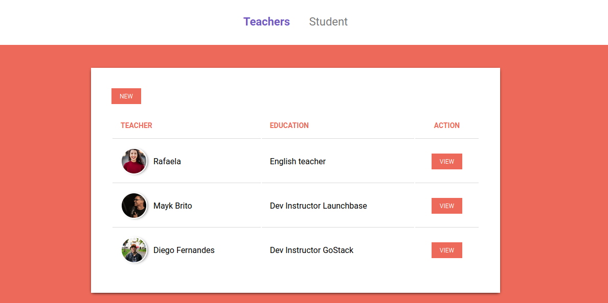

<h1 align="center">
    

<h1 align="center"> School Manager </h1>

 
   

 

## :book: School Manager
School Manager é um website com sistema de criação de alunos e professores desenvolvido no bootcamp da Rocketseat

## :email: Faq
- HTML
- CSS
- Javascript
- Nunjucks
- Nodejs 

## :memo: Licença
Lançado em 2020 
Esse projeto está sob a licença MIT. Veja o arquivo <a href="LICENSE">[LICENSE](/LICENSE) para mais detalhes.

    

Feito com :blue_heart: por [Rafael Linhares](https://www.linkedin.com/in/rafael-linhares-js/)
